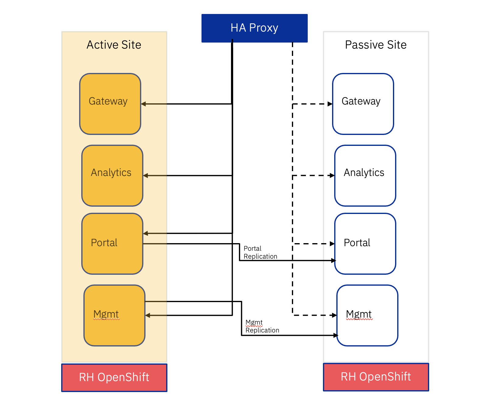

# IBM API Connect Multi-site HA Deployment (Active/Passive)
To achieve high availability in your API Connect deployment, a minimum of three data centers are required. This configuration creates a quorum of data centers, allowing automated failover in any direction, and enabling all three data centers to be active. The quorum majority voting algorithm, allows for a single data center to be offline, and yet still maintain data consistency and availability across the remaining two data centers as they continue to represent a majority in the deployment (avoiding split-brain syndrome). However, when having three data centers is not possible, a two data center deployment provides a disaster recovery solution that has both a low Recovery Time Objective (RTO), and a low Recovery Point Objective (RPO). The following information provides an overview of the concepts and architecture required for configuring a two data center deployment in API Connect.

## High-level notes about the two data center disaster recovery (DR) solution

* Two data center DR is strictly  
    - an Active/Passive deployment for the API Manager and Developer Portal services, 
    - manual failover.
* Two DataPower® gateway subsystems must be deployed to provide high availability for the gateway service. However, this scenario doesn't provide high availability for the analytics service.
* The deployment in each data center is effectively an instance of the same API Connect deployment - therefore, the endpoints, certificates, and Kubernetes secrets must all be the same.
* Each data center must be set up within its own Kubernetes cluster (OpenShift and VMWare are hosted on Kubernetes).
* If high availability is required for the analytics service, two analytics subsystems must be configured, one per gateway subsystem, but with this configuration Developer Portal analytics isn't possible.
* Data consistency is prioritized over data availability.
* Latency between the two data centers must be less than 80ms.
* Replication of the
    - API Manager is asynchronous so, depending on the amount of latency between the two data centers, there is a small possibility that recent updates are not transferred in the event of a failure.
    - Developer Portal is synchronous, and therefore the latency is limited to 80ms or less.
* The API Manager and the Developer Portal services in the two data centers must either all be highly available, or none of them highly available, and the number of nodes on each data center must match.

## Deployment Topology (Just for representation)
Below provided topoloyy which can not be consided for production. It is just for the demo and representaional purpose to explain the concept.



## Step-By-Step instructions
This article would help you to with step by step installation and configuration instructions to achieve IBM APIConnect multi-site HA Active/Passive also how to test the deployment in case of failure.

Pls refer to the youtube video for demo : https://www.youtube.com/watch?v=SDteeU-TJCY

### Pre-Requsite

1. Two RedHat OpenShift Cluster v4.9 or later with Storage Provisioned, IngressDomain configured. Pls ensure your OpenShift cluster configured with 16Core x 32GB RAM worker node. Minimum 3 worker nodes in each cluster.
2. HAProxy node which would act as load balancer for APIConnect in both the cluster. 
3. OpenShift Command line tool. `oc`
4. `yq` cli version 4.18.1 or later`


#### Data Center A - OpenShift Cluster Readiness
Installation and Configurations of OpenShift Cluster is not in the scope of this demo. For this demo I have used IBM TechZone Platform to provision OCP v4.10 with RWO storage provisioned along with Ingress-Domain. Please watch this video if you want to make use of IBM TechZone `Unleash IBM TechZone Platform https://www.youtube.com/watch?v=Ip348en661E` to provision OpenShift Cluster for Demo purposes.
From the existing cluster ensure you have the following details

`Ingress Domain` You can make use of the below command to get the ingress
```
oc get ingresses.config/cluster -o jsonpath={.spec.domain}
```
Provided an example of an output of the above command
`apps.itzocp-110000rrwb-u5n2.selfservice.aws.techzone.ibm.com`

Get the IP address of the IngressDomain of the OCP Cluster in Data Center A. Prepend some dummy name say `"dummy.<ingress domain of the OCP in Data Center A>"`
```
ping dummy.apps.itzocp-110000rrwb-u5n2.selfservice.aws.techzone.ibm.com
```
Have the IP address handy which would be used in HAProxy Configuration.

`StorageClasses` You can make use of the below command to get the StorageClass. Pls check with your OCP admin to get the right classname for `ReadWriteOnce (RWO)` storageclass
```
oc get sc
```


#### Data Center B - OpenShift Cluster Readiness
For checking the rediness, pls make use of the instructions provided in `Data Center A - OpenShift Cluster Readiness` section.


#### Install and Configure HAProxy service
For this demo I have used Ubuntu 20.04 LTS
```
apt-get update
sudo apt show haproxy
sudo apt install -y haproxy=2.4.\*
sudo systemctl status haproxy
sudo systemctl enable haproxy
```

##### Update haproxy.cfg
Edit and Add the detail in `/etc/haproxy/haproxy.cfg` at the EOF. Below provided the sample or eample configuration. 
***Pls read the #INFO in the below example and add the details that is applicable to your environment.***
```
frontend apic-https
 bind *:443
 mode tcp
 option tcplog
 use_backend apic-https

 backend apic-https
 mode tcp
 balance roundrobin
 option ssl-hello-chk
 
 #INFO: Ensure you comment the Passive Site 
 #INFO: Below on is pointing to Data Center A. This IP address (53.53.89.75) is IP address of Ingress Domain in DataCenter A
 server site-a-ingress-endpoint         53.53.89.75:443 check
 
 #INFO: Below on is pointing to Data Center B. This IP address (142.126.108.171) is IP address of Ingress Domain in DataCenter B
 #server site-b-ingress-endpoint         142.126.108.171:443 check
```
##### Update /etc/hosts
Add the entries in /etc/hosts for Ingress Domain of the both the datacenters A & B
```
site-a-ingress-endpoint        53.53.89.75
site-b-ingress-endpoint        142.126.108.171
```
`***NOTE***`
In the Active/Passive deployment, the `HAProxy should contain an entry that should always points to Active Site.` In this example, DataCenter A is an Active Site now. We also have the details of DataCenter B which is commented for future use while testing failover scenario. While we do a failover scenario testing, we need to swap the entry. i.e. Active becomes Passive and vice-versa. 

### Install APIConnect in Data Center A

Clone this repository 
```
git clone https://github.com/gowdhamanj/apic-multi-site-HA.git
cd apic-multi-site-HA
```

Using `oc` cli, Login to OpenShift cluster
```
oc login --token=sha256~iZrxDieN3jkEZfzmCwT_2KXBr8hnE3EUBGxV8c35E7U  --server=https://api.itzocp-110000rrwb-u5n2.selfservice.aws.techzone.ibm.com:6443
```
Create CatalogSource & Subscription for APIConnect Operator.
```
oc apply -f CatalogSource.yaml
oc apply -f Subscription.yaml
```
Pls wait for few mins before you go-ahead. Ensure APIConnect Operator is installed in "openshift-operators" namespace.

Create a namespace for deploying APIConnect instancee
```
oc new-project apic
```
Have Common Services Operand Request created
```
oc apply -f common-services-operandrequest.yaml
```
###### Obtaining your IBM entitlement API key
You are required to have an entitlement key that provides access to the software components. After the necessary entitlements have been granted, use the following steps to download the entitlement key and apply it to the automation:
    Visit the Container Software Library site - https://myibm.ibm.com/products-services/containerlibrary
    Log in with your IBMId credentials
    Assuming the entitlements are in place, you will be presented with an entitlement key. Click "Copy key".
    
```
export APIC_NAMESPACE=apic
export IBM_ENTITLEMENT_KEY=<paste the entitlement-key copied from previous step>

oc create secret docker-registry ibm-entitlement-key \
    --docker-username=cp \
    --docker-password=$IBM_ENTITLEMENT_KEY \
    --docker-server=cp.icr.io \
    --namespace=$APIC_NAMESPACE
```
Before you run the below command, Ensure you have "Cert Manager" Operator instaled in `ibm-common-services` namespace.
Create CertManager for APIC instance
```
oc apply -f Cert-Manager-for-api-instance-in-Datacenter-A.yaml
```
In case of any such below exceptions, wait for sometime and re-run the above command again.
```
Error from server (InternalError): error when creating "Cert-Manager-for-api-instance-in-Datacenter-A.yaml": Internal error occurred: failed calling webhook "webhook.cert-manager.io": failed to call webhook: Post "https://cert-manager-webhook.ibm-common-services.svc:443/mutate?timeout=10s": no endpoints available for service "cert-manager-webhook"
Error from server (InternalError): error when creating "Cert-Manager-for-api-instance-in-Datacenter-A.yaml": Internal error occurred: failed calling webhook "webhook.cert-manager.io": failed to call webhook: Post "https://cert-manager-webhook.ibm-common-services.svc:443/mutate?timeout=10s": no endpoints available for service "cert-manager-webhook"
Error from server (InternalError): error when creating "Cert-Manager-for-api-instance-in-Datacenter-A.yaml": Internal error occurred: failed calling webhook "webhook.cert-manager.io": failed to call webhook: Post "https://cert-manager-webhook.ibm-common-services.svc:443/mutate?timeout=10s": no endpoints available for service "cert-manager-webhook"
Error from server (InternalError): error when creating "Cert-Manager-for-api-instance-in-Datacenter-A.yaml": Internal error occurred: failed calling webhook "webhook.cert-manager.io": failed to call webhook: Post "https://cert-manager-webhook.ibm-common-services.svc:443/mutate?timeout=10s": no endpoints available for service "cert-manager-webhook"
Error from server (InternalError): error when creating "Cert-Manager-for-api-instance-in-Datacenter-A.yaml": Internal error occurred: failed calling webhook "webhook.cert-manager.io": failed to call webhook: Post "https://cert-manager-webhook.ibm-common-services.svc:443/mutate?timeout=10s": no endpoints available for service "cert-manager-webhook"
```
We should create the common Encryption Key for Management & Portal component between both the Site A & B
```
 cat /dev/urandom | head -c63 | base64  > mgmt-enc-key.txt
 oc create secret generic mgmt-encryption-key --from-file=encryption_secret.bin=mgmt-enc-key.txt -n $APIC_NAMESPACE
 cat /dev/urandom | head -c63 | base64 - > ptl-enc-key.txt
 oc create secret generic ptl-encryption-key --from-file=encryption_secret=ptl-enc-key.txt -n $APIC_NAMESPACE
```
While we are working on Data Center A, we should provide IngressDomain of Data Center B. I assume you have IngressDomain name handy which you would have obtained in section `Data Center B - OpenShift Cluster Readiness`

Pls update the below environment varibles before setting it up.

```
export DATA_CENTRE_A_INGRESS_DOMAIN=<pasted the Ingress domain of the Data Center A>
export DATA_CENTER_A_RWO_STORAGECLASS=<paste the RWO storage class in Data Center A>
export DATA_CENTRE_B_INGRESS_DOMAIN=<pasted the Ingress domain of the Data Center B>
```
#Prove the Ip address of HA Proxy server
```
export HA_PROXY_IP=140.229.168.60
export HA_MODE=active
```

Update the ingress domain & storgeclass in *apic-instance-in-data-center-A.yaml* 

Execute the below commands
```
export HA_PROXY_IP=`echo $HA_PROXY_IP | sed 's/\./-/g'`
cat apic-instance-in-data-center-A.yaml | sed "s/TO_BE_REPLACED_BY_DATA_CENTER_A_INGRESS_DOMAIN/$DATA_CENTRE_A_INGRESS_DOMAIN/" > A1.yaml
cat A1.yaml | sed "s/TO_BE_REPLACED_BY_DATA_CENTER_B_INGRESS_DOMAIN/$DATA_CENTRE_B_INGRESS_DOMAIN/" > A2.yaml
cat A2.yaml | sed "s/TO_BE_REPLACED_BY_DATA_CENTER_A_RWO_STORAGECLASS/$DATA_CENTER_A_RWO_STORAGECLASS/" > A3.yaml
cat A3.yaml | sed "s/TO_BE_REPLACED_HA_PROXY_IP/$HA_PROXY_IP/" > A4.yaml
cat A4.yaml | sed "s/TO_BE_REPLACED_HA_MODE/$HA_MODE/" > apic-instance-in-data-center-A.yaml
rm -f A1.yaml A2.yaml A3.yaml A4.yaml

```

###### Create an instance of apiconnect in Data Center A by executing the below command
```
oc apply -f apic-instance-in-data-center-A.yaml
```
Get the Certificate Authority Issuer Secret from Data Center A.
```
oc get secret apis-dev-ingress-ca -o yaml > ca-issuer-secret.yaml
```
***NOTE:-***
Open ca-issuer-secret.yaml file, remove creationTimestamp, resourceVersion, uid, selfLink and managedFields property and save the file.

```
yq -i 'del(.metadata.uid)' ca-issuer-secret.yaml && cat ca-issuer-secret.yaml
yq -i 'del(.metadata.creationTimestamp)' ca-issuer-secret.yaml && cat ca-issuer-secret.yaml
yq -i 'del(.metadata.resourceVersion)' ca-issuer-secret.yaml && cat ca-issuer-secret.yaml

```

### Install APIConnect in Data Center B
Using `oc` cli, Login to OpenShift cluster
```
oc login --token=sha256~a8lvYB14bIO7HhjJ7KIb4JgP2eT_G2Pg2mgDT3kEkZs --server=https://c100-e.eu-gb.containers.cloud.ibm.com:32280
```
Create CatalogSource & Subscription for APIConnect Operator.
```
oc apply -f CatalogSource.yaml
oc apply -f Subscription.yaml
```
Create a namespace for APIConnect
```
oc new-project apic
```
Have Common Services Operand Request created
```
oc apply -f common-services-operandrequest.yaml
```
If you see some exception like the below, wait for sometime an re-run the above command

```
unable to recognize "common-services-operandrequest.yaml": no matches for kind "OperandRequest" in version "operator.ibm.com/v1alpha1"
unable to recognize "common-services-operandrequest.yaml": no matches for kind "OperandRequest" in version "operator.ibm.com/v1alpha1"
unable to recognize "common-services-operandrequest.yaml": no matches for kind "OperandRequest" in version "operator.ibm.com/v1alpha1"
unable to recognize "common-services-operandrequest.yaml": no matches for kind "OperandRequest" in version "operator.ibm.com/v1alpha1"
unable to recognize "common-services-operandrequest.yaml": no matches for kind "OperandRequest" in version "operator.ibm.com/v1alpha1"
unable to recognize "common-services-operandrequest.yaml": no matches for kind "OperandRequest" in version "operator.ibm.com/v1alpha1"
```

```
export APIC_NAMESPACE=apic
export IBM_ENTITLEMENT_KEY=<paste the entitlement-key copied from  Obtaining your IBM entitlement API key step>

oc create secret docker-registry ibm-entitlement-key \
    --docker-username=cp \
    --docker-password=$IBM_ENTITLEMENT_KEY \
    --docker-server=cp.icr.io \
    --namespace=$APIC_NAMESPACE
```
Create CertManager for APIC instance in DataCenter B
```
oc apply -f Cert-Manager-for-api-instance-in-Datacenter-B.yaml
```
```
oc apply -f ca-issuer-secret.yaml
```
Set the env variable
```
export DATA_CENTRE_B_INGRESS_DOMAIN=<pasted the Ingress domain of the Data Center B>
export DATA_CENTER_B_RWO_STORAGECLASS=<paste the RWO storage class in Data Center B>
export DATA_CENTRE_A_INGRESS_DOMAIN=<pasted the Ingress domain of the Data Center A>
```
#Prove the Ip address of HA Proxy server
```
export HA_PROXY_IP=140.229.168.60
export HA_MODE=passive
```
Execute the below commands
```
export HA_PROXY_IP=`echo $HA_PROXY_IP | sed 's/\./-/g'`
cat apic-instance-in-data-center-B.yaml | sed "s/TO_BE_REPLACED_BY_DATA_CENTER_B_INGRESS_DOMAIN/$DATA_CENTRE_B_INGRESS_DOMAIN/" > B1.yaml
cat B1.yaml | sed "s/TO_BE_REPLACED_BY_DATA_CENTER_A_INGRESS_DOMAIN/$DATA_CENTRE_A_INGRESS_DOMAIN/" > B2.yaml
cat B2.yaml | sed "s/TO_BE_REPLACED_BY_DATA_CENTER_B_RWO_STORAGECLASS/$DATA_CENTER_B_RWO_STORAGECLASS/" > B3.yaml
cat B3.yaml | sed "s/TO_BE_REPLACED_HA_PROXY_IP/$HA_PROXY_IP/" > B4.yaml
cat B4.yaml | sed "s/TO_BE_REPLACED_HA_MODE/$HA_MODE/" > apic-instance-in-data-center-B.yaml
rm -f B1.yaml B2.yaml B3.yaml B4.yaml

```
Create the Management & Portal Encryption Key. The same key that is used in Data Center A
```
 oc create secret generic mgmt-encryption-key --from-file=encryption_secret.bin=mgmt-enc-key.txt -n $APIC_NAMESPACE
 oc create secret generic ptl-encryption-key --from-file=encryption_secret=ptl-enc-key.txt -n $APIC_NAMESPACE
```
###### Create an instance of apiconnect in Data Center B by executing the below command
```
oc apply -f apic-instance-in-data-center-B.yaml
```

### APIConnect Installation verification in Data Center A & B
In both the data center, execute the below command and check the status of apiconnectcluster before you proceed to Next section.
```
oc get apiconnectcluster
```
You should see "STATUS==Ready". Providing the output of the above command

```
NAME       READY   STATUS   VERSION    RECONCILED VERSION   AGE
apis-dev   4/4     Ready    10.0.5.0   10.0.5.0-1281        107m
```


### Configure APIConnect in Data Center A
I strongly belive that the user is well versed in Configure the following. In case you need help for the below steps pls refer to IBM APIConnect 10.0.x documentation
1. Configure EMail Server
2. Configure Topology
3. Create Provider Organization
4. Login to Provider Organization using API Manager
5. Create Catalog for e.g "demo"
6. Enable Gateway Services in the newly created Catalog
7. Create Developer-Portal for the newly created catalog
8. Create & Deploy an API in the the 'demo' catalog. Make use of the API yaml "weather-in-city_1.0.0.yaml" & Product yaml "weatherproduct_1.0.0.yaml"
9. Launch the Developer Portal
10. Register a new "Consumer Organization" for e.g 'zDeveloper'
11. Login to Developer portal as 'zDeveloper'
12. Browse for the APIs
13. Subscribe for an API
14. Test the API


### Failover Testing
To achieve failover testing, we need to change the state of HAMode. In this scenario, we started with Data Center A as 'Active' & Data Center B as 'Passive'. 
Let us get started

`In Data Center A`
1. Login to Data Center A Cluster

`For Making changes in Management Component`

    2. Run the below command   
        oc get managementcluster
    

    3. Get the current state by running the below command
    
        oc describe managementcluster apis-dev-mgmt -n apic | grep 'Ha Mode' 
    
    4. Edit 'apis-dev-mgmt' and change mode from 'active'---to---> 'passive'. Run the below command to search for 'mode: active' under 'multiSiteHA:'
    
        oc edit managementcluster apis-dev-mgmt -n apic
       


`For Making changes in Portal Component`

    5. Run the below command
    
        oc get portalcluster
    
    
    6. Get the current state by running the below command
    
        oc describe portalcluster apis-dev-ptl -n apic | grep 'Ha Mode'
    
    7. Edit 'apis-dev-ptl' and change mode from 'active'---to---> 'passive'. Run the below command to search for 'mode: active' under 'multiSiteHA:'
    
        oc edit portalcluster apis-dev-ptl -n apic
    


`In Data Center B`
1. Login to Data Center B Cluster

`For Making changes in Management Component`

    2. Run the below command   
        oc get managementcluster
    

    3. Get the current state by running the below command
    
        oc describe managementcluster apis-dev-mgmt -n apic | grep 'Ha Mode' 
    
    4. Edit 'apis-dev-mgmt' and change mode from 'passive'---to---> 'active'. Run the below command to search for 'mode: passive' under 'multiSiteHA:'
    
        oc edit managementcluster apis-dev-mgmt -n apic
       


`For Making changes in Portal Component`

    5. Run the below command
    
        oc get portalcluster
    
    
    6. Get the current state by running the below command
    
        oc describe portalcluster apis-dev-ptl -n apic | grep 'Ha Mode'
    
    7. Edit 'apis-dev-ptl' and change mode from 'passive'---to---> 'active'. Run the below command to search for 'mode: passive' under 'multiSiteHA:'
    
        oc edit portalcluster apis-dev-ptl -n apic
    


Pls refer to the [Fail Over Testing](https://www.ibm.com/docs/en/api-connect/10.0.1.x?topic=deployment-failure-handling-two-data-center)  for more details. 
```
Provided an extract from the APIC documentation.
Entire data center failover

To failover an entire data center, follow the previous steps to failover the API Manager service, followed by the steps to failover each Developer Portal service in that data center.

How long it takes to complete the failover varies, and depends on hardware speed, network latency, and the size of the databases. However, here are some approximate timings:
For API Manager:

    passive to active approximately 5 minutes
    active to passive approximately 15 minutes

For Developer Portal:

    passive to active 15 - 40 minutes
    active to passive approximately 10 minutes


```

### Update HAProxy To point to currently active site
Edit the `/etc/haproxy/haproxy.cfg` by swapping the entry
```
 #INFO: Ensure you comment the Passive Site 
 #INFO: Below on is pointing to Data Center A. This IP address (53.53.89.75) is IP address of Ingress Domain in DataCenter A
 #server site-a-ingress-endpoint         53.53.89.75:443 check
 
 #INFO: Below on is pointing to Data Center B. This IP address (142.126.108.171) is IP address of Ingress Domain in DataCenter B
 server site-b-ingress-endpoint         142.126.108.171:443 check
```

### To Validate the replicated data from DateCenter A to DataCenter B

I strongly belive that the user is well versed in Configure the following. In case you need help for the below steps pls refer to IBM APIConnect 10.0.x documentation
1. Login to API Admin Console and Validate
2. Login to API Manager & Validate
3. Login to Developer Portal & Validate
4. Test the API & Validate


### Summary
Pls consider this article for Dev/Learning & Demo purposes. 


